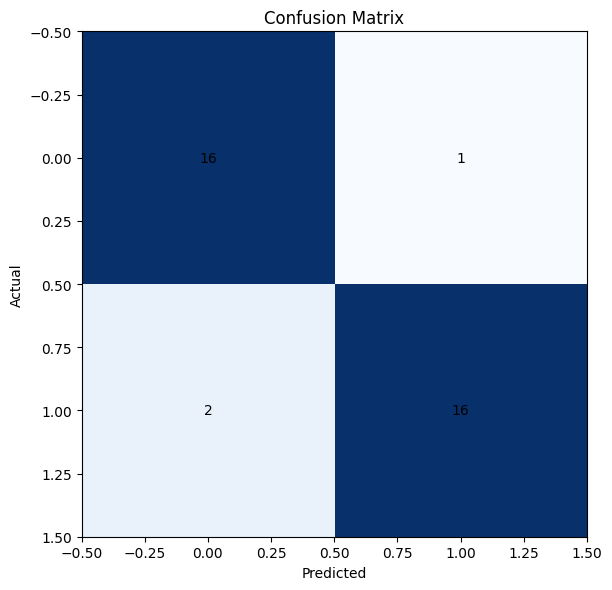
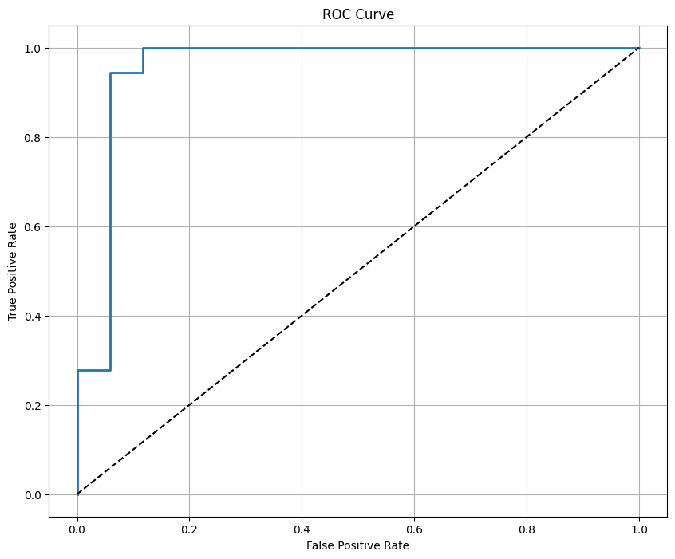
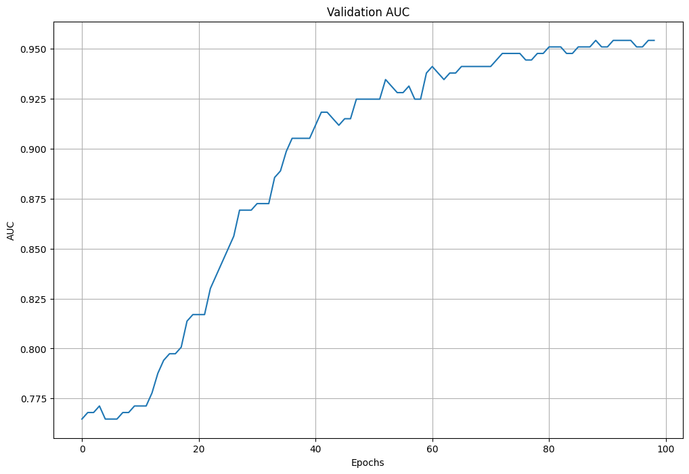
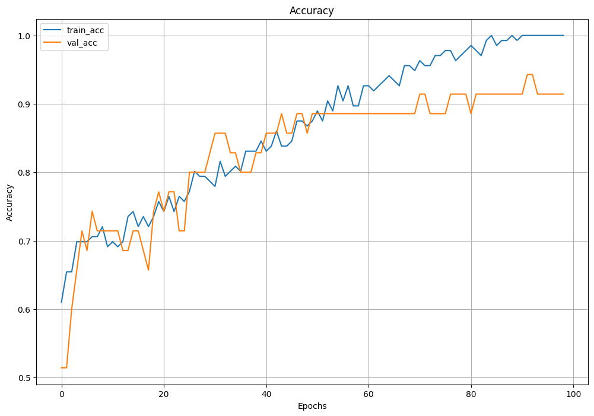
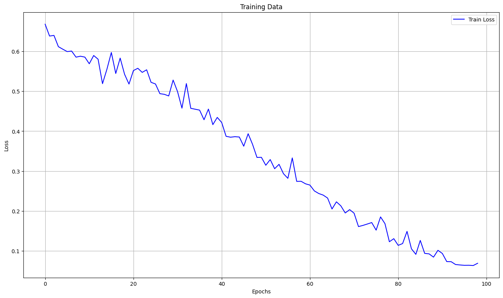
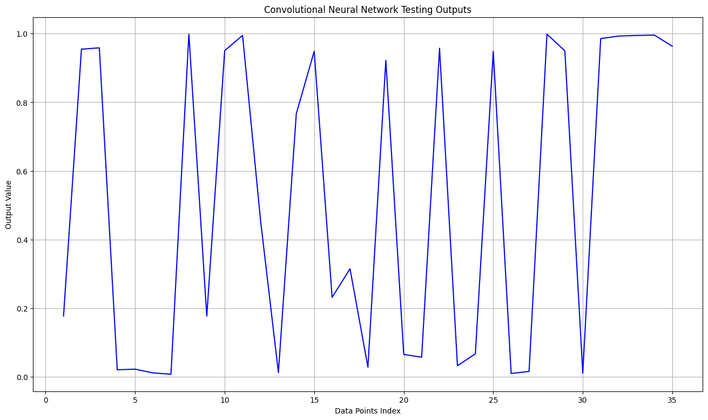

# Brain Tumor MRI Classification

A deep learning project for binary classification of brain MRI images into **tumor** and **healthy** categories using a **Convolutional Neural Network (CNN)** built with PyTorch. The model leverages **data augmentation**, **train/test splitting**, and **performance visualization** to achieve high accuracy and AUC.

---

## 📂 Dataset

- **Source**: Preprocessed dataset of MRI images (two classes: `yes` for tumor, `no` for healthy).
- **Image size**: Resized to 128×128 pixels, normalized to `[0, 1]`.
- **Augmentation**: Applied rotation, flipping, and brightness adjustments to increase dataset size (~5000 total images).

---

## 🧠 Model Architecture

- **Type**: Convolutional Neural Network (CNN)
- **Layers**:
  - 2D convolutional layers with Tanh activation
  - Max-pooling layers
  - Fully connected dense layers
  - Sigmoid activation for binary classification
- **Loss function**: Binary Cross Entropy Loss (BCELoss)
- **Optimizer**: Adam Optimizer
- **Learning rate**: 0.001
- **Epochs**: 100

---

## 📊 Training Results

- **Final Accuracy**: **91.4%**
- **Validation AUC**: **0.95**
- **Confusion Matrix**:
  - TP: 16, TN: 16, FP: 1, FN: 2

---

<!-- ## 📈 Example Plots

| Confusion Matrix                                  | ROC Curve                           |
| ------------------------------------------------- | ----------------------------------- |
|  |  |

| Validation AUC                               | Accuracy Curves                          |
| -------------------------------------------- | ---------------------------------------- |
|  |  |

| Training Loss                               | Model Outputs                         |
| ------------------------------------------- | ------------------------------------- |
|  |  | -->

---
